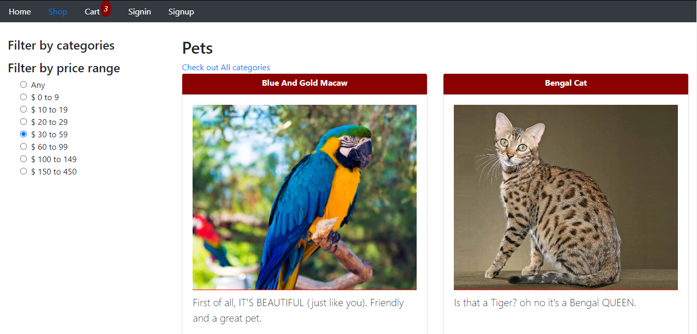

# SellMate

An E-commerce site designed for pet buy-sell and maintenance.

# Demo

[Sellmate](http://front-sellmate.herokuapp.com/)

# Screenshot

- Home Page

  

- Filtered Shopping


# Features

- Browse for your desired pets.
- Can filter by category & price
- Place orders
- Make payment
- Users can blog about their pets.

# Tools

- MongoDB
- Express.js
- React.js

### Running locally

Frontend

```
cd front-sellmate
npm run start
```

Backend

```
cd SellMate
npm run start
```

### Deploying to heroku

Frontend

```
heroku git:remote -a front-sellmate -r heroku-frontend
heroku config:set -a front-sellmate $(cat ./.env)
git subtree push --prefix front-sellmate/ heroku-frontend main
```

Backend

```
heroku git:remote -a sellmate-backend -r heroku-backend
heroku config:set -a sellmate-backend $(cat ./.env)
git subtree push --prefix SellMate/ heroku-backend main
```
